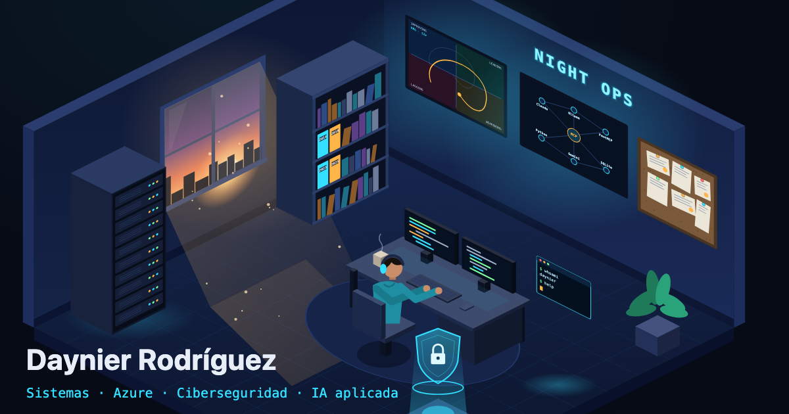

# CV interactivo · Night Ops

CV web de **Daynier Rodríguez Ruíz**. Es una sala de operaciones nocturna en vista isométrica y cada objeto abre una sección del CV.

- 🌐 **https://daynierr-max.github.io/** · enlace directo al CV clásico: **https://daynierr-max.github.io/#cv**
- 📄 PDF: [`Daynier_Rodriguez_CV2026.pdf`](public/Daynier_Rodriguez_CV2026.pdf)



## Cómo se usa

| Objeto | Sección |
|---|---|
| Escritorio con monitores y avatar | Sobre mí |
| Rack de servidores | Infraestructura y Azure |
| Escudo holográfico | Ciberseguridad |
| Pantalla de nodos | IA y MCP |
| Pantalla con gráfico de rotación (RRG) | Proyectos |
| Estantería con carpetas | Experiencia |
| Tablón de corcho | Certificaciones y formación |
| Terminal flotante (o tecla <kbd>`</kbd>) | Easter egg: `help`, `whoami`, `skills`, `contact`, `cv --pdf` |
| Ventana al amanecer | Contacto |

**Modo reclutador** y **Descargar PDF** están siempre visibles arriba a la derecha.

## Stack y decisiones

- **Vite + TypeScript**, sin framework ni dependencias de runtime. El JS inicial ocupa unos 18 KB gzip y la terminal se carga bajo demanda.
- **Escena 100 % SVG generada por código**: una proyección isométrica 2:1 y cajas y planos a partir de funciones utilitarias ([`src/render/iso.ts`](src/render/iso.ts)). No usa imágenes de terceros.
- **Prerender en build**: la escena, las tarjetas y el modo reclutador (ES) van en el HTML estático. Así el contenido es indexable y pinta sin esperar al JS.
- **Fuente única de verdad**: [`src/data/cv.es.json`](src/data/cv.es.json) y [`src/data/cv.en.json`](src/data/cv.en.json).
- **Animación** solo con `transform` y `opacity` (y el trazo SVG del gráfico RRG). El bucle se pausa mientras hay un panel abierto.
- **Accesibilidad**:
  - Cada hotspot es un `<button>` con `aria-label`.
  - Los paneles son `<dialog>` nativos: `Esc` cierra y el foco vuelve al objeto.
  - Con `prefers-reduced-motion` todo queda quieto.
  - En móvil la escena se convierte en tarjetas.
  - Al imprimir sale el CV clásico.

## Comandos

```bash
npm ci --ignore-scripts
npm run dev        # desarrollo
npm run build      # typecheck + build + informe de tamaño JS (falla si > 150 KB gzip)
npm run preview    # sirve dist/ en :4173
npx playwright install chromium
npm run test       # Playwright (escritorio 1440×900 y móvil 375×812) + capturas en /screenshots
npm run lhci       # Lighthouse CI (rendimiento ≥ 90, a11y/buenas prácticas/SEO ≥ 95)
npm run og         # regenera public/og.png desde la escena (con preview en marcha)
npm run fps        # mide los fps del bucle (con preview en marcha)
```

El despliegue se hace en GitHub Pages desde GitHub Actions ([`.github/workflows/deploy.yml`](.github/workflows/deploy.yml)). Las acciones están fijadas por SHA, se instala con `npm ci --ignore-scripts` y el pipeline pasa build, tests y Lighthouse antes de publicar.

## Estructura

```
src/
  data/            cv.es.json · cv.en.json (contenido)
  render/          iso.ts · scene.ts · recruiter.ts · panels.ts · shell.ts · head.ts
  main.ts          interacción (paneles, idioma, modo reclutador)
  terminal.ts      easter egg (chunk diferido)
  styles.css
tests/             Playwright
scripts/           size-report · lhci-summary · og · fps
```
